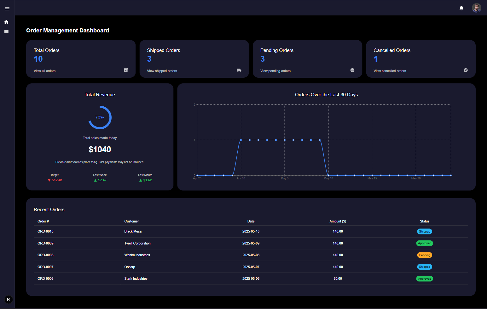

## Order Management Dashboard

A modern internal dashboard to manage orders.

## Dashboard Preview



## Tech Stack
- Next.js 15 (App Router + Server Actions)
- TypeScript + React 19
- Material UI v7 + X DataGrid v8
- Recharts
- JSON as local API data source

## Features

- Collapsible sidebar + top user modal 
- Home page with live summary          
- Orders table with sorting + filters  
- Create order with validation rules   
- Modular View page (read-only mode)   
- Chronological history log            
- Additional filters (date, codes)     
- Fully responsive & accessible UI   

## Modularization

Modularization Approach: I combined the Create and View Order pages into a single dynamic route using a shared OrderForm component.
The form switches between editable and read-only modes using readOnly, defaultValues, and an optional onSubmit prop.
This approach reduces code duplication, improves maintainability, and provides a consistent user experience.

## Getting Started

- Node.js (v18+ recommended)

- Data Source
  The app uses data/orders.json as a local "backend". When creating or deleting orders, this file is updated through API routes under /api/orders.

- Install the dependencies: npm install

- First, run the development server:

```bash
npm run dev
# or
yarn dev
# or
pnpm dev
# or
bun dev
```

Open [http://localhost:3000](http://localhost:3000) with your browser to see the result.

You can start editing the page by modifying `app/page.tsx`. The page auto-updates as you edit the file.

This project uses [`next/font`](https://nextjs.org/docs/app/building-your-application/optimizing/fonts) to automatically optimize and load [Geist](https://vercel.com/font), a new font family for Vercel.


## Deploy on Vercel

The easiest way to deploy your Next.js app is to use the [Vercel Platform](https://vercel.com/new?utm_medium=default-template&filter=next.js&utm_source=create-next-app&utm_campaign=create-next-app-readme) from the creators of Next.js.

Check out our [Next.js deployment documentation](https://nextjs.org/docs/app/building-your-application/deploying) for more details.


